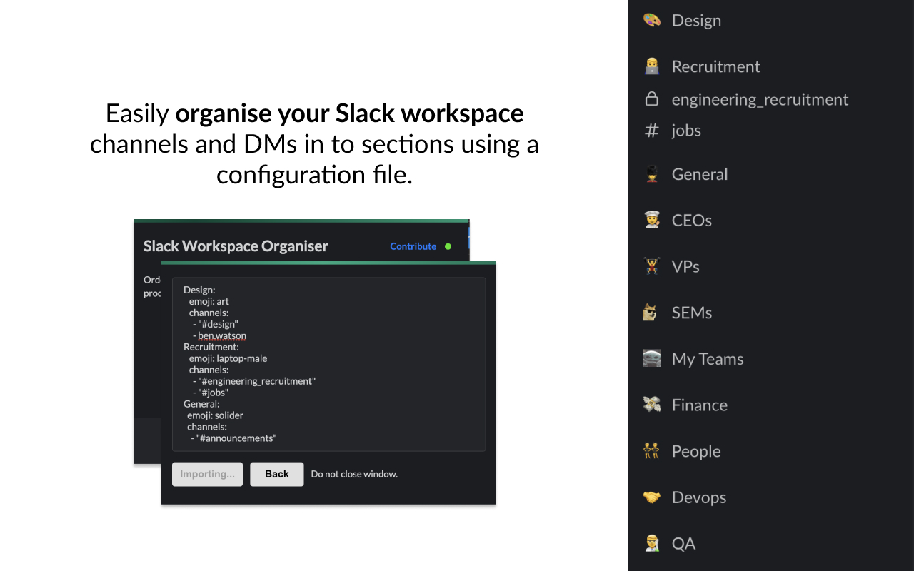

# Slack Workspace Organiser



Organise your Slack sidebar by using a yaml file. Ordering your sidebar helps 
with productivity and makes it easier to find the right person, team or topic.

Does your company use Slack Workspace Organiser? If so, please consider [sponsoring this project](https://github.com/sponsors/blwsh)

## Example Configuration

Below is an example configuration file which is used by the extension to create sections and move channels and DMs into them.
You can export your current Slack workspace configuration by clicking the export button in the extension popup.

```yaml
Design:
  emoji: art       # You can use any emoji supported by Slack in addition to custom ones you've added to your workspace.
  channels:
    - "#design"    # You can organise channels
    - "ben.watson" # and DMs in to sections
Recruitment:
  emoji: laptop-male
  channels:
    - "#engineering_recruitment"
    - "#jobs"
General:
  emoji: solider
  channels:
    - "#announcements"
```

## Contributing

All contributions are welcome. Please read the [contribution guidelines](CONTRIBUTING.md) before you start.

### Installation

```bash
$ npm install
```

### Development

```bash
$ npm run start
```


